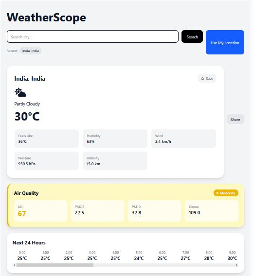
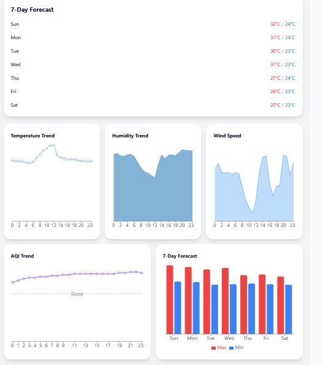
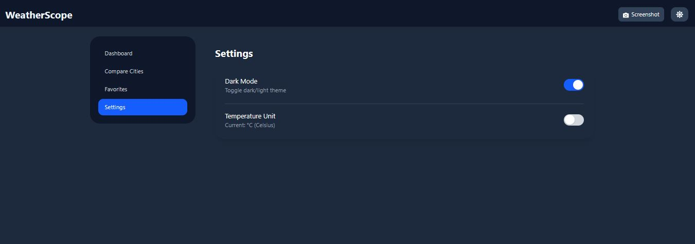
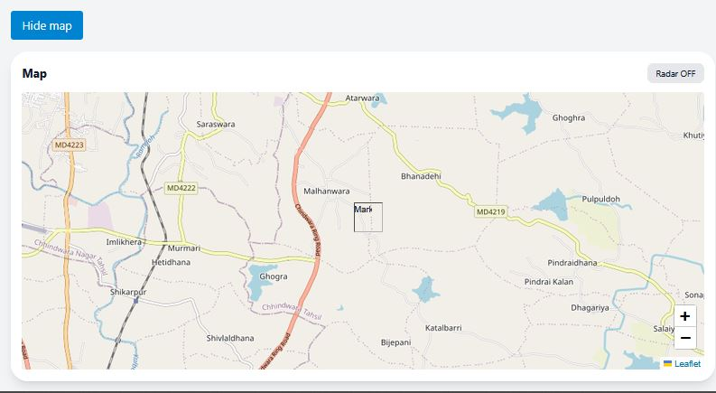
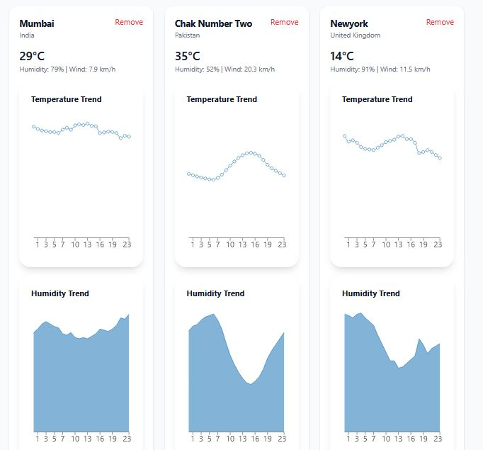
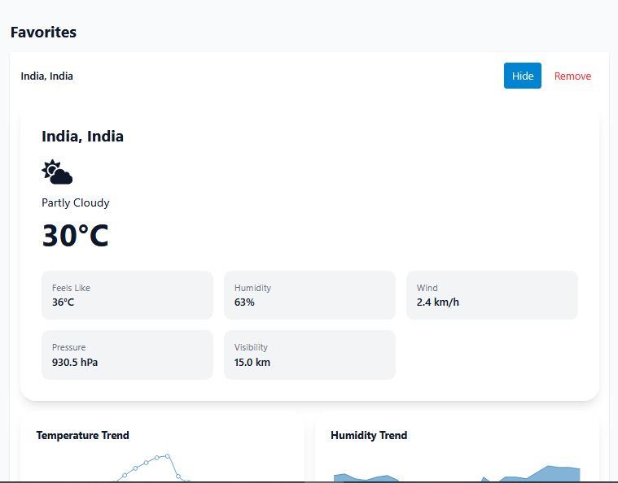

# WeatherScope


A modern, feature-rich weather dashboard built with **React**, **Vite**, and **Tailwind CSS**. WeatherScope delivers real-time weather forecasts, air quality monitoring, interactive maps, weather analytics, and Progressive Web App (PWA) support in a clean, responsive interface.

---

## 🌐 Live Demo

**Live Website:** https://weather-scope-gilt.vercel.app/

**GitHub Repository:** https://github.com/nehndiblessing/weather-scope

---

## 📸 Screenshots








---

# ✨ Features

## 🌤️ Weather

* Current weather conditions
* Feels-like temperature
* Humidity
* Wind speed
* Atmospheric pressure
* Visibility
* UV Index
* Sunrise & Sunset

---

## 📅 Forecasts

* 24-Hour Forecast
* 7-Day Forecast
* Weather condition icons
* Temperature trends

---

## 🌍 Search & Location

* Search weather by city
* Geolocation support
* Recent searches
* Favorite cities

---

## 🌫️ Air Quality

* AQI (Air Quality Index)
* PM2.5
* PM10
* Ozone
* Color-coded AQI status

---

## 🗺️ Interactive Map

* Leaflet + OpenStreetMap
* Interactive weather map
* Location marker
* Map navigation

---

## 📊 Analytics

* Temperature charts
* Humidity charts
* Wind trends
* Forecast visualization

---

## ⚠️ Weather Alerts

Automatic alerts for:

* Extreme heat
* Strong winds
* High UV exposure

---

## 🎨 User Experience

* Responsive design
* Dark / Light mode
* Smooth animations
* Loading skeletons
* Error boundaries
* Shareable URLs

---

## 📱 Progressive Web App

* Installable
* Offline support
* Cached weather data
* Cached map tiles
* Automatic updates

---

# 🛠️ Tech Stack

### Frontend

* React
* Vite
* JavaScript (ES6+)
* Tailwind CSS

### Routing

* React Router

### State Management

* React Hooks
* React Query

### Charts

* Recharts

### Maps

* Leaflet
* React Leaflet

### Animations

* Framer Motion

### PWA

* vite-plugin-pwa
* Workbox

### APIs

* Open-Meteo Weather API
* Open-Meteo Air Quality API
* Open-Meteo Geocoding API
* OpenStreetMap

---

# 📁 Project Structure

```text
src/
├── api/
├── app/
├── assets/
├── components/
│   ├── charts/
│   ├── layout/
│   ├── ui/
│   └── weather/
├── context/
├── hooks/
├── pages/
├── utils/
└── main.jsx
```

---

# 🚀 Getting Started

Clone the repository

```bash
git clone https://github.com/nehndiblessing/weather-scope.git
```

Move into the project

```bash
cd Weather_scope
```

Install dependencies

```bash
npm install
```

Run the development server

```bash
npm run dev
```

Build for production

```bash
npm run build
```

Preview production build

```bash
npm run preview
```

---

# 🚀 Deployment

This project is deployed on **Vercel**.

Every push to the **main** branch automatically triggers a new deployment.

Live URL:

https://weather-scope-gilt.vercel.app/

---

# 💡 Future Improvements

* Weather radar overlays
* Historical weather data
* Weather notifications
* Multi-language support
* Unit customization
* More advanced weather insights

---

# 👨‍💻 Author

**NDI BLESSING NEH**

GitHub: https://github.com/nehndiblessing

---

## ⭐ Support

If you found this project useful, consider giving it a ⭐ on GitHub.

---

## 📄 License

This project is licensed under the MIT License.